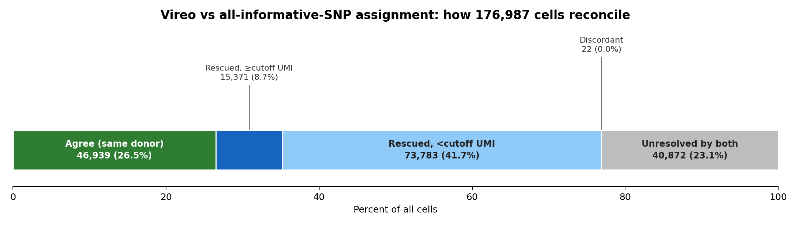
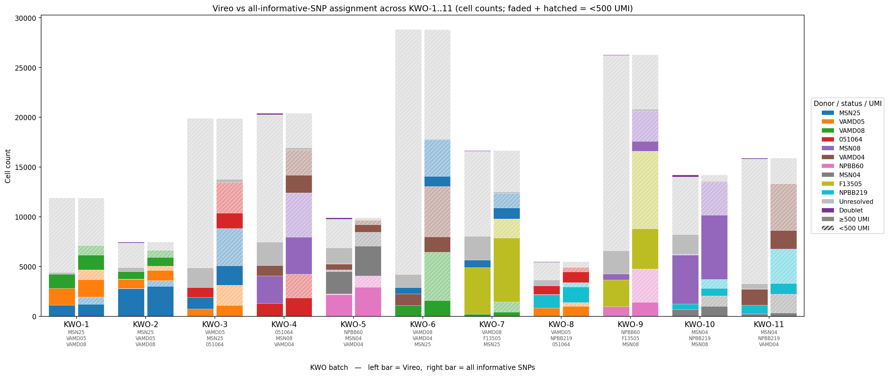
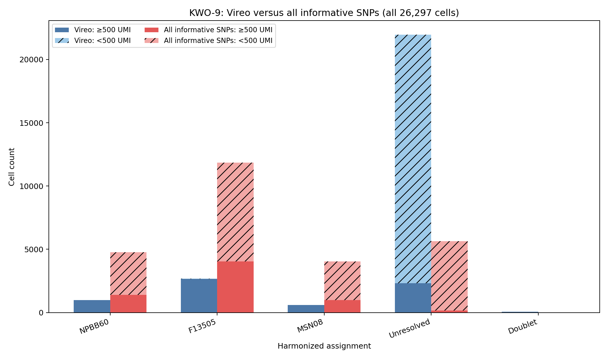
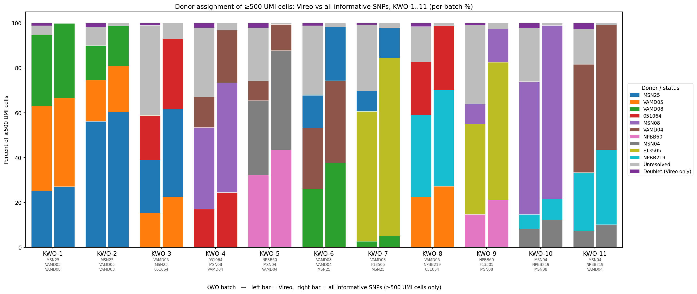

# Organoid Demultiplexing — Donor Assignment from All Informative SNPs

This is our pipeline for the **Kristen Organoids single-cell RNA-seq project**
(batches **KWO-1 through KWO-11**, three donors pooled per 10x run). Each
batch is demultiplexed with **Vireo**, but Vireo only calls a donor when it's
>90% confident, which leaves a lot of cells `Unassigned`. This repo is our
from-scratch cross-check: it re-derives a donor call for every cell directly
from the raw allele reads at every SNP that actually distinguishes that
batch's three donors, independent of Vireo, and compares the two.

We built this to answer one question for the KWO batches: *of the cells
Vireo left unassigned, how many can we actually resolve from the reads
themselves, and how much should we trust that call?*

**Contents:** [Results](#results-at-a-glance) ·
[Method](#the-method) ·
[Setup](#setup) ·
[Running it](#running-it-on-the-kwo-batches) ·
[Scripts, with real examples](#every-script-with-a-real-example-from-our-data) ·
[Synthetic test data](#try-it-without-touching-real-data) ·
[Donor mapping](#donor-name-harmonization)

## Results at a glance

Across all 11 KWO batches, **176,987 cells** total:



### Assignments from each method

| | Vireo | All-informative-SNP (this pipeline) |
|---|--:|--:|
| Assigned to a donor | 46,961 (26.5%) | 136,111 (76.9%) |
| Unresolved | 129,051 (72.9%) | 40,876 (23.1%) |
| Doublet | 975 (0.6%) | — (no doublet model) |

### Overlap, where both methods make a call

| | Cells | % of jointly-resolved cells |
|---|--:|--:|
| Same donor (agree) | 46,939 | 99.96% |
| Different donor (disagree) | 18 | 0.04% |

Essentially total agreement (46,939 vs. 18) wherever both methods are
willing to commit to a donor.

### Recovering Vireo's unassigned / doublet cells

Vireo does not confidently call **130,026** cells (129,051 `Unassigned` +
975 `Doublet`). Of those:

| | Cells | % of the 130,026 |
|---|--:|--:|
| Recovered (all-SNP assigns a donor) | **89,154** | 68.6% |
| — with ≥500 UMI | 15,371 | 17.2% of recovered |
| — with <500 UMI | 73,783 | 82.8% of recovered |
| Still unresolved by both methods | 40,872 | 31.4% |

So roughly two-thirds of the cells Vireo gives up on can be resolved from
the reads alone — but **83% of those recoveries are `<500 UMI`**, i.e. a
handful of reads deciding the call. We treat those as provisional, not
equivalent in confidence to a Vireo singlet.

### Still ambiguous or unresolved with our approach

**40,876 cells (23.1% of all cells)** remain unresolved by the all-SNP
method too:

| | Cells |
|---|--:|
| `Ambiguous` — exact tie between ≥2 donors | 24,388 |
| `No evidence` — zero informative-SNP reads | 16,488 |

The batch-by-batch breakdown behind all of this:



Left bar of each pair = Vireo, right bar = this pipeline, coloured by donor.
See `examples/` for the `≥500 UMI`-only version and a single-batch example.

## The method

1. **Find donor-informative SNPs.** For a batch's three donors, a SNP is
   informative if all three have a valid genotype there (`0/0`, `0/1`,
   `1/1`) and at least two of them differ.
2. **Score each cell against each donor.** Summing over every informative
   locus the cell has reads at:
   ```
   loglik[donor] += ALT_reads * ln(p) + REF_reads * ln(1 - p)
   ```
   where `p = P(observe an ALT read | genotype)` = `{0/0: 0.01, 0/1: 0.5, 1/1: 0.99}`.
3. **Call the donor with the highest total.** An exact tie → `Ambiguous`.
   Zero informative reads → `No evidence`.
4. **Flag by UMI** (`<500` vs `≥500`, configurable) and compare against
   Vireo's `vireo_status` / `vireo_donor`.

No doublet model, no prior, no genotype uncertainty — it's deliberately the
simplest possible per-read tally, so where it disagrees with Vireo the
disagreement is informative (almost always: too few reads to trust either
call).

## Setup

```bash
pip install -r requirements.txt
```

## Running it on the KWO batches

Point `--data-dir` at wherever your `KWO-N_SNP_evidence_part01.tsv.gz` and
`KWO-N_cell_scores.tsv.gz` files live (not tracked in this repo — see
`data/README.md`):

```bash
python assign_donors_from_snps.py --data-dir /path/to/KWO_data --out-dir results
python scripts/combine_batches.py            --results-dir results
python scripts/filter_umi500.py              --results-dir results
python scripts/summarize_overlap.py          --results-dir results
python scripts/summarize_combined_figure.py  --results-dir results
python scripts/plot_reconciliation_summary.py --results-dir results
```

Batches (`KWO-1`, `KWO-2`, ...) and each batch's donor trio are read
straight from the file names and the `GT_<donor>` columns — nothing is
hard-coded, so it also just works if a KWO-12 shows up later, or if a batch
has a different donor trio.

## Every script, with a real example from our data

### 1. `assign_donors_from_snps.py` — per-batch assignment

The core step: computes the all-SNP call for every cell in a batch, flags
UMI, and compares to Vireo.

```bash
python assign_donors_from_snps.py --data-dir /path/to/KWO_data --out-dir results
```
```
KWO-9: donors=['NDBB060->NPBB60', 'F13505->F13505', 'MSN08->MSN08'] cells=26297 <500 UMI=19689 loci=12310 informative=11031
```
Writes, per batch, `results/<batch>_all_SNPs_vs_vireo/`: the per-cell calls
(`all_SNP_cell_assignments_UMI_flagged.tsv`), count tables, and a bar chart.
Here's KWO-9's:



### 2. `scripts/combine_batches.py` — every batch, one figure

```bash
python scripts/combine_batches.py --results-dir results
```
Produces the batch-by-batch figure in **Results at a glance**
(`combined_vireo_vs_allSNP_UMI_counts.png` / `..._percent.png`), plus
`combined_bar_counts.tsv` — the tidy data behind it and behind script 5.

### 3. `scripts/filter_umi500.py` — the same comparison, confident cells only

```bash
python scripts/filter_umi500.py --results-dir results
```
Same layout, restricted to `≥500 UMI` cells (no UMI hatching needed — it's
now a hard filter), same donor colours as script 2:



At ≥500 UMI the two bars are nearly identical in every batch — the extra
donor calls the all-SNP method finds are concentrated almost entirely in
the low-UMI cells filtered out here.

### 4. `scripts/summarize_overlap.py` — assigned vs. unassigned, and the overlap

```bash
python scripts/summarize_overlap.py --results-dir results
```
Prints (and writes `vireo_vs_snp_method_totals.tsv` / `vireo_vs_snp_overlap.tsv`):
```
## Method totals (confident assignments)
| batch | total_cells | vireo_assigned | vireo_unassigned | vireo_doublet | snp_assigned | snp_unresolved |
| ALL   | 176,987     | 46,961         | 129,051          | 975           | 136,111      | 40,876         |

## Overlap of the two approaches
| batch | total_cells | both_same_donor | both_diff_donor | vireo_only | snp_only_rescued | neither |
| ALL   | 176,987     | 46,939          | 18               | 4          | 89,154            | 40,872  |
```

### 5. `scripts/summarize_combined_figure.py` — the figure, as a table

```bash
python scripts/summarize_combined_figure.py --results-dir results
```
Reshapes script 2's output into per-batch and combined tables with the net
change per category:
```
### ALL batches combined
| assignment | Vireo ge | Vireo lt | Vireo total | allSNP ge | allSNP lt | allSNP total | Δ total |
| Donor      | 46,325   | 636      | 46,961      | 61,692    | 74,419    | 136,111      | +89,150 |
| Unresolved | 15,630   | 113,421  | 129,051     | 1,237     | 39,639    | 40,876       | -88,175 |
| Doublet    | 974      | 1        | 975         | 0         | 0         | 0            | -975    |
```

### 6. `scripts/plot_reconciliation_summary.py` — the headline figure and numbers

```bash
python scripts/plot_reconciliation_summary.py --results-dir results
```
Partitions every cell into exactly one outcome (agree / rescued ≥500 UMI /
rescued <500 UMI / discordant / unresolved by both) and produces the
figure at the top of this README plus `reconciliation_summary.tsv`. This is
the script behind every number in **Results at a glance** above.

## Try it without touching real data

`data/example/` is a 5-cell, fully-synthetic dataset that hits every
outcome the pipeline can produce (agree, rescue, tie, no evidence, doublet)
— useful for testing changes to the code without going near real donor
genotypes:

```bash
python assign_donors_from_snps.py --data-dir data/example --out-dir /tmp/example_results
python scripts/combine_batches.py --results-dir /tmp/example_results
```

## Donor name harmonization

`donor_mapping.py` collapses aliases for the same donor across runs (e.g.
`SRR13291835` and `NDBB060` are the actual donor IDs behind two of our KWO
donor codes, `MSN04` and `NPBB60`). Add new aliases to `DONOR_MAPPING` as we
pick up more batches; anything not listed passes through unchanged.

## A note on the real donor data

Real KWO batch files (`*_SNP_evidence_part01.tsv.gz`, `*_cell_scores.tsv.gz`)
contain donor genotype calls and are **not** tracked in this repo — see
`data/README.md` for the file format and where they live for us. Only the
synthetic example and the aggregate result figures/tables above (cell
counts, not genotypes) are checked in.
